## Hugo本地搭建

### 部署hugo工具
从官方下载的压缩包中，有一个hugo.exe工具，它用于hugo博客的一般操作 
Windows下进行操作：

* 进入官方github页下载压缩包程序 
  https://github.com/gohugoio/hugo/releases

* 解压压缩包以后可以看到一个hugo.exe可执行程序，在环境变量中添加当前目录，使得可以在任意目录下执行hugo.exe命令

* 添加完环境变量，通过hugo version测试环境变量设置是否成功

### 新建博客站点

选择一个你想存放个人博客的本地目录，运行指令
```
hugo new site "博客目录名称"
```
### 生成
执行下面命令会生成public文件夹
```
hugo
```

### 本地服务开启
开启本地服务
```
hugo server 
```
进入localhost:1313可以在本地预览博客
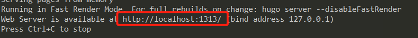
使用系统命令发表的文章默认都是草稿，打开生成的md文件会看到draft: true的标记，草稿是无法渲染的，如果要渲染包含草稿在内的所有文章需要运行下面指令
```
hugo server -D
```

### 设置主题

官方主题库地址：https://themes.gohugo.io/

以pure主题为例：https://themes.gohugo.io/hugo-theme-pure/

* 下载主题包后，解压后放到blog目录blog/themes目录下，并修改文件夹名为pure
* 进入blog\themes\even\exampleSite目录，复制config.yml文件，要保证该文件内的theme字段的值跟blog/themes目录下的主题文件夹同名
  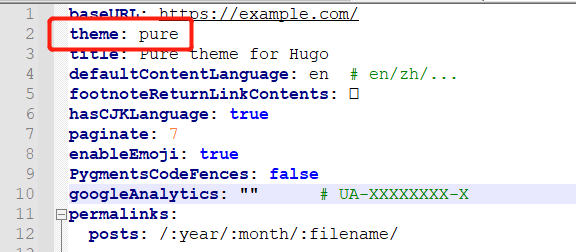


推荐主题：
https://github.com/dillonzq/LoveIt


### 发表第一篇文章

执行下面指令，会在blog/content/posts/目录下生成test.md文件
```
hugo new posts/test.md
```


## GiteePages配置
* 新建仓库
  项目名称和路径都要保持一致，全部填tutucoo（下图是搬的官方文档，没有改过来，见谅）
  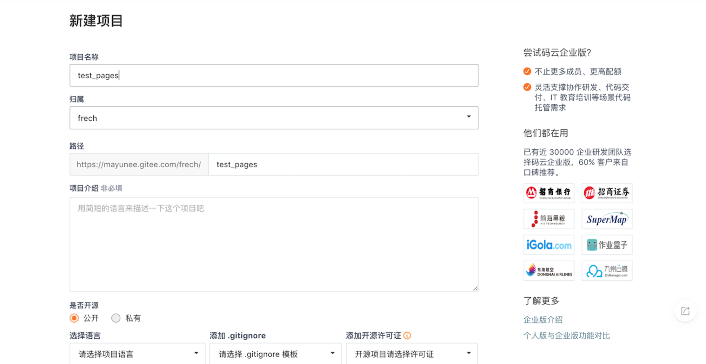

点击创建完成仓库的创建

* 添加文件
  点击新建文件

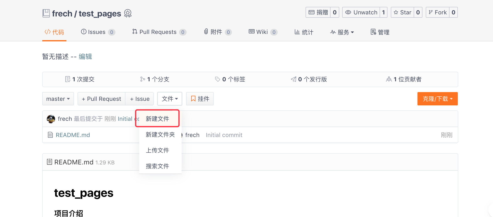

文件名输入index.html，内容就是简单的html

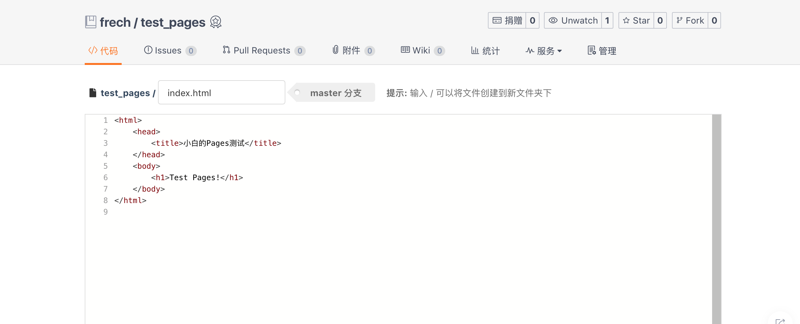

点击提交，将文件提交到仓库

* 选择 pages 服务
  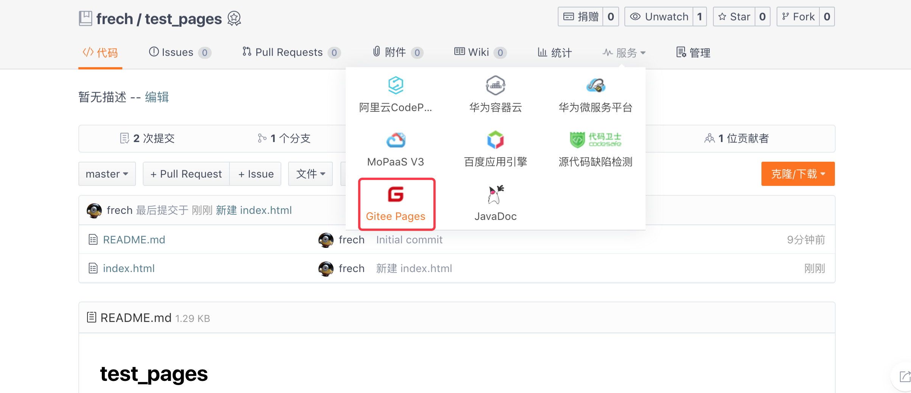

* 选择需要部署的分支，这里选择 Master 启动服务。
  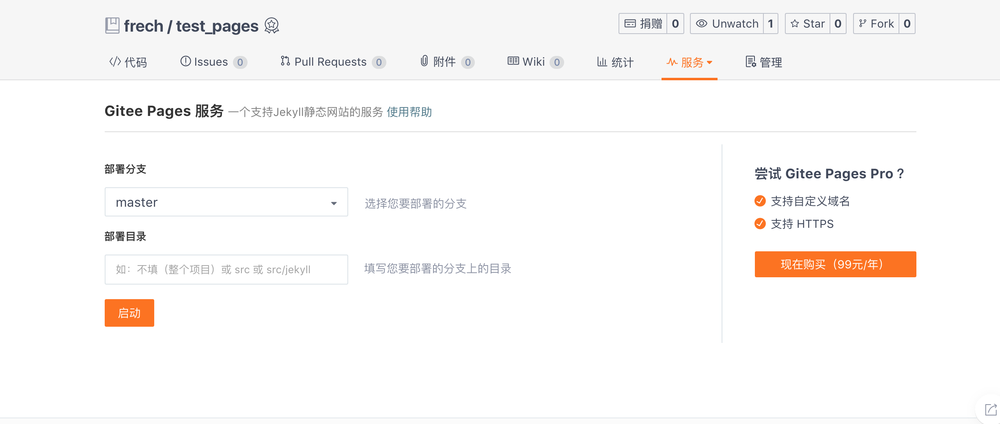

* 访问生成的网站地址，即可以查看你部署的静态页面啦！
  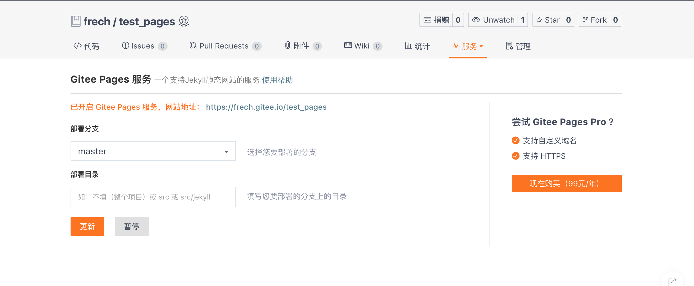

## 上传Blog到Gitee

* 修改本地blog配置
  blog根目录下的config.yml文件需要进行修改，地址填写自己blog的地址，注意后面要添加/
  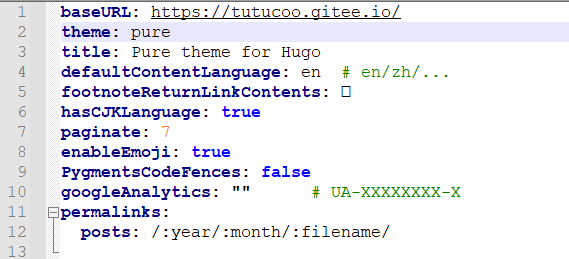

* 上传本地blog
  进入blog根目录，执行命令初始化git仓库

```
git init
```
查看当前git文件状态，可以看到很多红字，就是待添加到本地库中的文件了
```
git status
```
添加文件到缓存中
```
git add .
```
发布到本地文件库中
```
git commit -m "d"   
```
添加远程仓库地址
```
git remote add https://gitee.com/tutucoo/tutucoo.git
```
拉取远程库
```
git pull
```
此时会报错，因为之前在gitee仓库GiteePages时添加了index.html文件，导致历史信息不同
使用下面命令进行拉取
```
git pull origin master --allow-unrelated-histories
```
拉取成功后，本地出现了readme.md文件和index.html文件，删除它们，然后重新更新本地库
```
git status
git add .
git commit -m "dd"
```
最后push到远程gitee库中
```
git push -u origin master
```
如果不是第一次push，可以使用下面命令
```
git push
```

* 修改GiteePages目录为public
  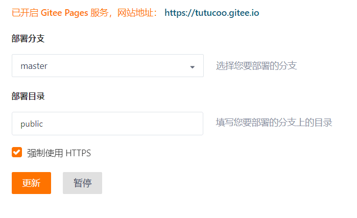
  更新完之后，进入网站地址就可以了


## 图文文章

博客的核心功能当然是管理文章啦~但是之前生成文章的方式只适合没有图片的情况，如果文章里面有图片就会非常麻烦，而且不利于每篇文章的图片单独管理，Hugo官方推荐把资源放到static目录进行引用，我觉得还是有点不方便的，我需要的是一篇文章一个文件夹，图片在文件夹下面单独存放。
我的方法是创建一个以文章名称命名的文件夹，文件夹内创建一个index.md文件，图片就放在这个文件夹内，引用的时候直接用图片名称就可以了
```
hugo new posts/这是我的第一篇文章/index.md
```
执行完上面命令，或者纯手动创建都是可以的
文章编辑完以后，执行编译
```
hugo
```
git一条龙操作
```
git status
git add .
git commit -m "tt"
git push
```
最后进入GiteePages服务点击更新按钮
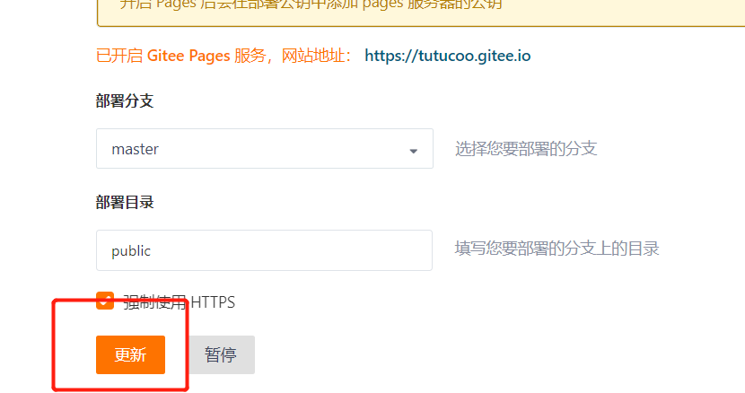
等待片刻，更新网站，文章就发表上去了


## 评论系统valine配置

我使用的loveit主题，版本是0.2.10，自带了valine

首先，去leancloud.app注册个账号，找到里面的应用keys

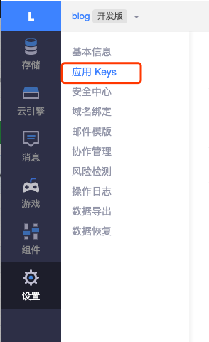

再到blog根目录下找到config.toml，找到[params.page.comment.valine]，将appId和appKey填入，enable设置为true，其他的参数不需要设置

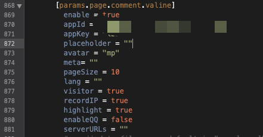

然后再进入到leancloud的存储页中，创建两个Class，一个是Comment用于接收评论，另一个是Counter，用于统计文章访问次数

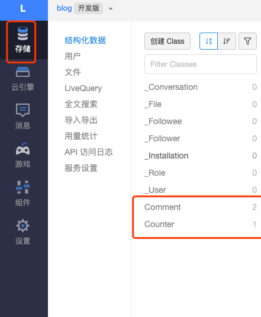

最后，本地进行调试，注意要切换到发布版，否则看不到评论系统

```
hugo server -e production
```

此时进入评论区发表评论，如果正常的话，就可以在页面的最下方看到刚发表的评论了，并且在leancloud后台可以接收到评论内容

再看文章阅读次数，也有了变化！

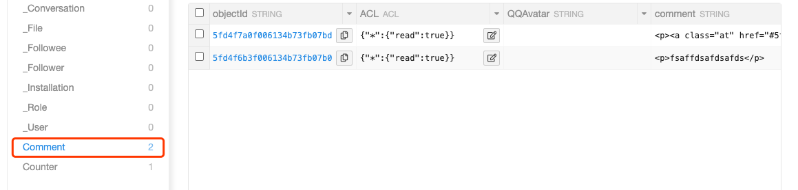


## 常见问题


### 不显示css样式

浏览器中f12查看源码，在head元素里看下css加载路径是否正确，如果不正确，需要在配置文件里面进行设置
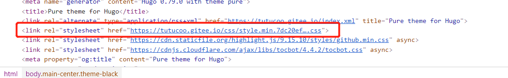

### Gitee上传到github无法显示
push以后Gitee没有自动更新，导致文章不显示的问题。
1. GiteePages免费版不支持自动更新编译，需要手动更新，所以需要进入GiteePages服务处点击更新GiteePages服务
2. 另外，GiteePages编程Hugo的判断依据是：

> 仓库编译目录下存在config.toml|json|yaml文件和content目录的时候，会使用hugo生成静态文件。

配置文件的后缀千万不要弄错了，我就是把yaml错写成yml，gitee一直没有编译，导致文章一直没有更新


