## GitPages搭建
1. 创建一个仓库

  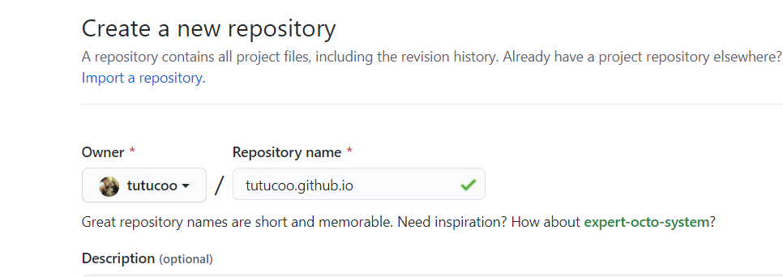

2. 进入blog仓库，点击settings，一直拖到最下面，可以看到Github Pages，点击Select theme，选择一个主题后返回会可以看到站点已经被开通了
   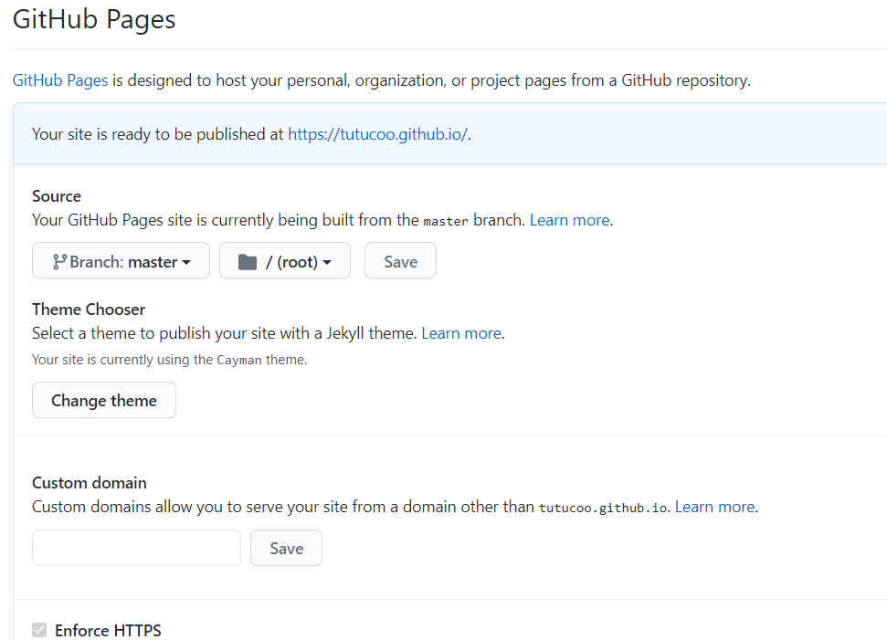

## hexo本地配置
1. 安装npm
后面需要npm包管理器来安装相关工具，进入下面地址进行下载
```
https://nodejs.org/en/
```
查看npm版本，确保安装成功
```
node -v
npm -version
```

2. 安装hexo工具
首先要通过npm工具安装hexo工具
```
npm i hexo-cli -g 
```
检验hexo是否安装成功
```
hexo -v
```
3. 本地安装hexo
创建一个文件夹temp，进入文件夹执行下面的指令
```
hexo init
```
接下来安装hexo依赖
```
npm install
```
生成静态页面
```
hexo g
```
开启本地服务器
```
hexo s
```
进入http://localhost:4000/，就可以看到博客搭建好了
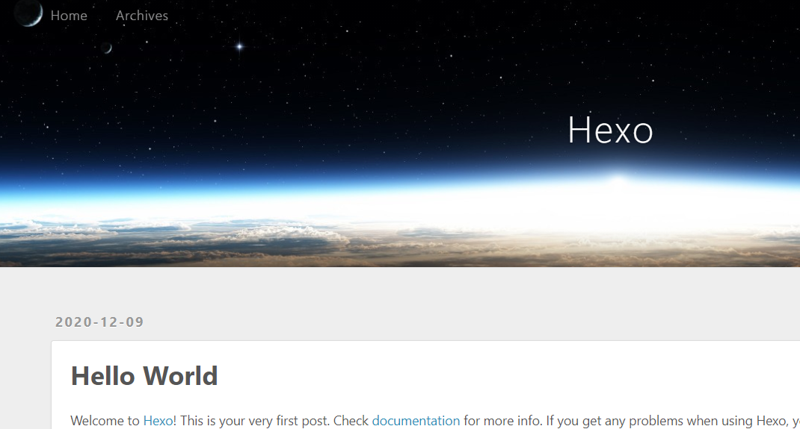

## 部署Hexo到Github Pages
1.克隆之前创建的Github Pages所在的仓库到本地
2.将本地部署文件夹temp下面所有文件拷贝到克隆的根目录下面
3.修改_config.yml文件
第一处修改url
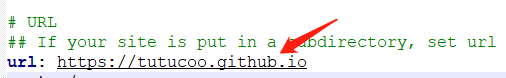\
第二处修改deploy，注意branch要填写main
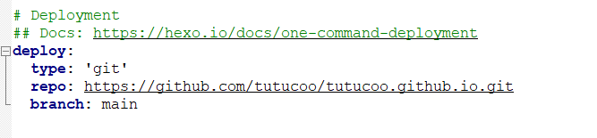
4.安装插件，用于一键编译并部署到github
```
npm install hexo-deployer-git --save
```
5.进行部署
```
hexo d
```
6.部署成功后就可以登录网站看下效果了
有时候浏览器有缓存，页面不会更新，可以清理缓存或者关闭Chrome缓存之后重新打开首页
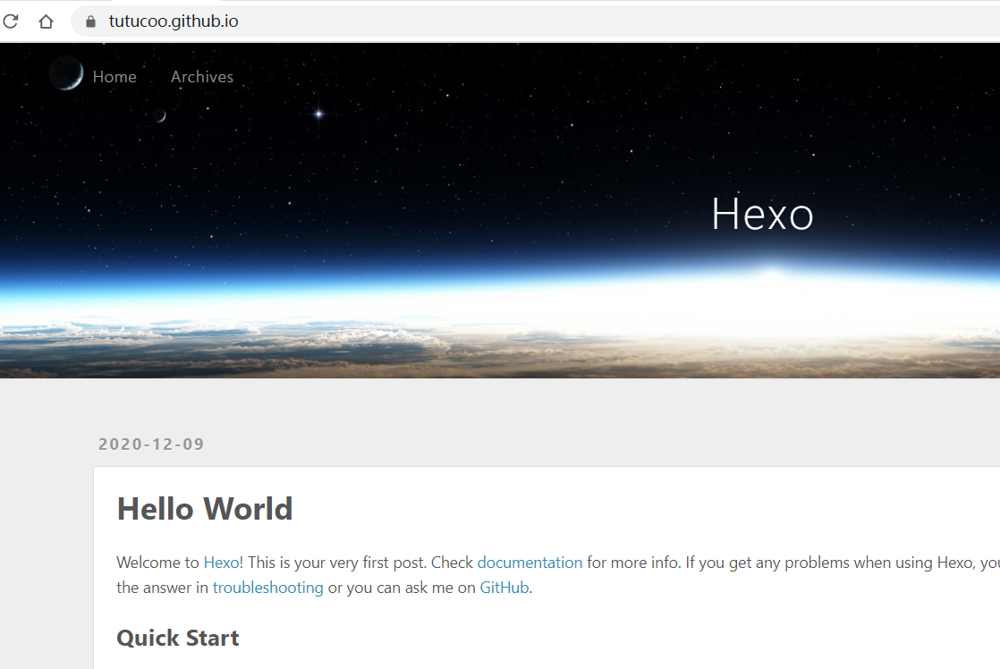

## 绑定顶级域名
1. 去godaddy网站上购买，支持支付宝，购买过程简单，就不多说了
2. github仓库绑定域名
可以通过直接在settings里面的custom domain里面设置，设置成功以后仓库会出现CNAME文件，不过这样设置的缺点是，每次hexo d指令执行以后，仓库的CNAME文件都会消失，导致顶级域名无法访问，需要在设置里面重新填入域名
我的方案是，在本地的source目录下创建一个CNAME文件，里面填上自己的顶级域名，比如我的是tutucoo.me，这样每次hexo d指令都会带上这个CNAME文件，就不再需要手动在settings里再进行设置啦
这一步做完要确保仓库的根目录生成一个CNAME文件
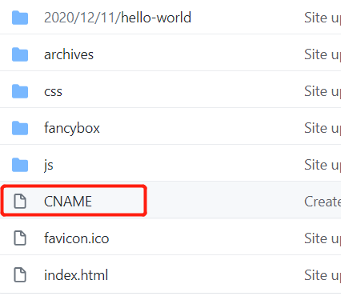
3. 设置DNSPOD，接管DNS解析
进入我的产品

进入DNS管理
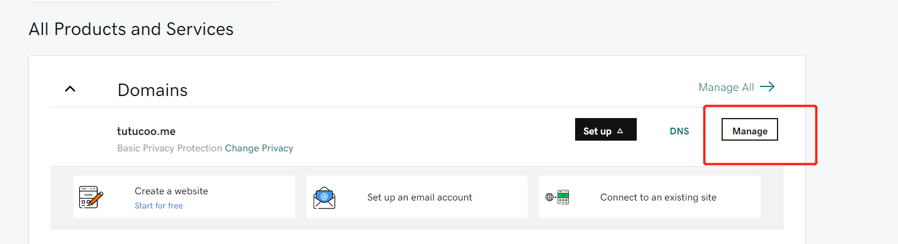
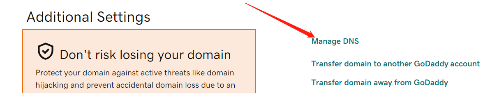
填入DNSPOD的nameservers，利用腾讯的DNS解析服务接管godaddy的dns解析，速度比godaddy快的多，另外这个服务使用简单、免费
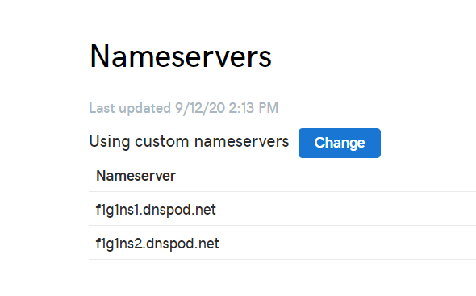
那么这个nameserver的地址哪里获取呢？
进入后台后，在DNS解析-我的域名处，添加一个域名，点击DNS错误右边的叹号就能看到DNS服务器地址了
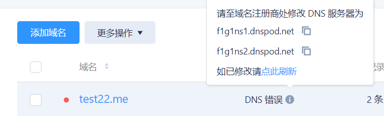
godaddy中填入这两个地址后，就可以不用再在godaddy中进行任何设置了，之后的DNS解析的工作全部交给DNSPOD
添加一个域名，进行下图进行设置。
A记录填写的是185.199.108.153，Github Pages支持https，不过前提是需要将以下任意一个IP填写到DNS解析服务的A记录里
```
185.199.108.153
185.199.109.153
185.199.110.153
185.199.111.153
```
填写完之后保存，等待生效，之后就可以用顶级域名进行访问啦。
如果没有生效，可能是先在仓库中生成的CNAME，而填写A记录是在后面进行的，导致没有触发HTTPS，重新在项目仓库里的自定义域名处填入自己的顶级域名触发HTTPS就可以了（当然，就像前面说的，我们这里采取的方式是在sources文件夹下创建CNAME文件，之后hexo d生成的CNAME）

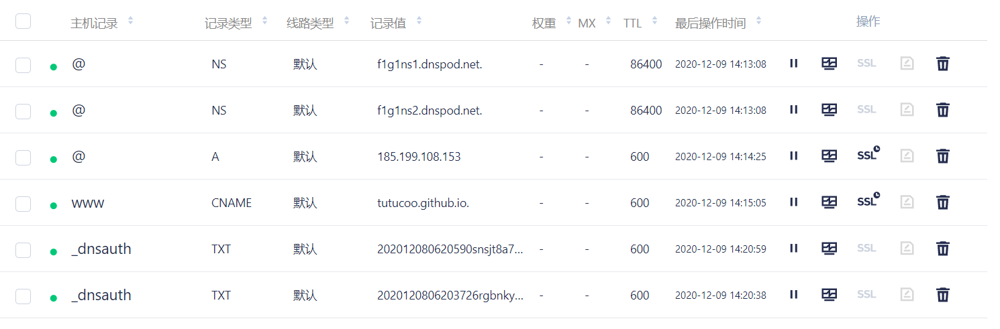

## 多终端同步hexo源码
在执行hexo d发布到github中的是编译后的文件，而源码是不会上传的，这就造成了，直接git clone下来的只有发布文件，没有源码，因此想在另一台电脑上编辑blog就无法进行，这里可以采用新建hexo分支的方式解决这个问题，hexo分支用来上传源码，main分支用来进行hexo d，这样在换一台电脑时，git  clone下来的就是源码了，而hexo的配置文件里面指定的分支是main，所以hexo d指令执行之后会自动发布到main分支上，git push会推送到hexo分支上，通过这种方式就可以实现多终端编辑和发布blog了。

这是main分支的发布的文件，不是源码
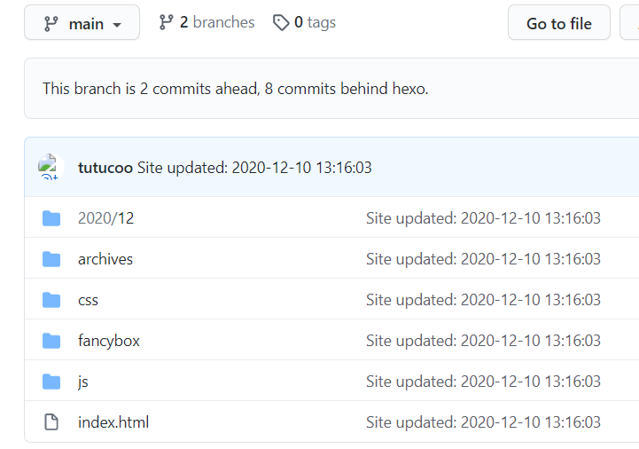

首先在github仓库上创建一个分支，在输入框中输入hexo，创建一个叫hexo的分支，分支创建好之后，会把main分支里面的代码全部拷贝到hexo分支里面
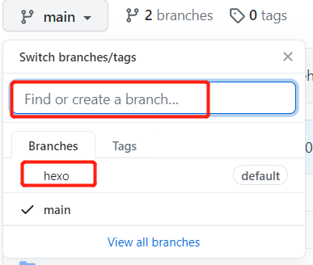 
接下来，进入仓库Settings，修改默认分支为hexo

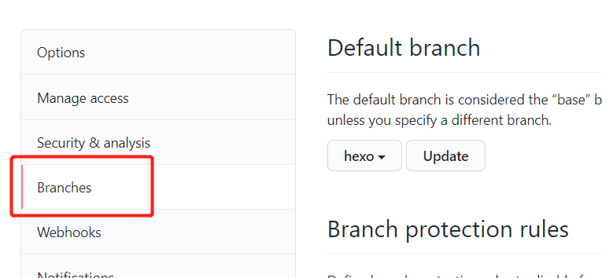
创建好分支之后，git clone到本地，查看分支，hexo分支已经作为默认分支了
```
git branch
```
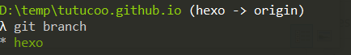
此时clone的文件夹里除了.git文件夹，其他的全部删除掉，然后把hexo源码文件夹里的文件拷贝到clone的文件夹中（除了.deploy_git、.git以及public文件夹）
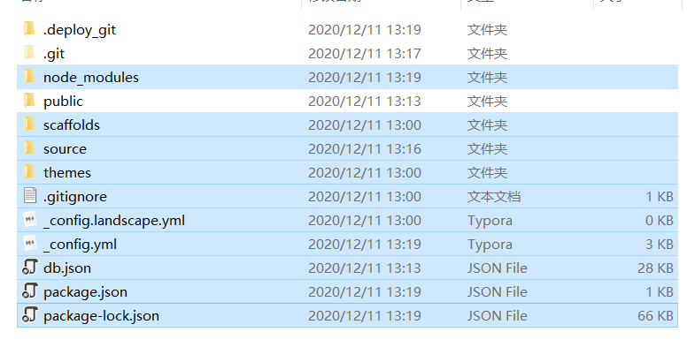

将源码上传到hexo分支中
```
git status
git add .
git commit -m ''
git push
```
此时跳转到hexo分支，可以看到刚推送上来的源码了，为了验证推送源码和发布网页不冲突，创建个新文章
```
hexo new test
```
然后发布到github
```
hexo g
hexo d
```
如果正常的话，此时新的文章就可以在首页上看到了，进入hexo分支，还是之前推送的源码，没有进行任何变动
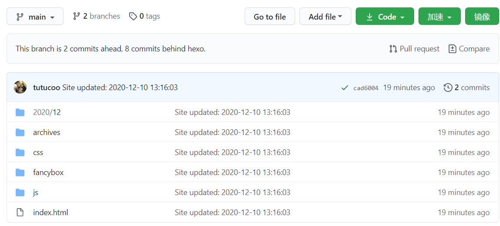

因为发布了新的文章，源码也有了变动，继续将更改push到hexo分支，可以看到source文件夹中的文件成功推送了
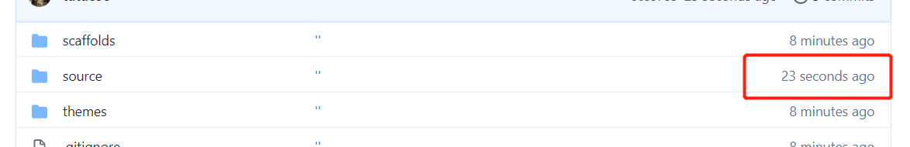

通过这种方式实现了多终端同步
## 文章管理

### 创建文章
对于一般的文章直接使用下面的命令就可以在source/_posts文件夹下看到新建的文章了
```
hexo new 文章名
```
### 文章常用标记
打开新建的文章，可以看到文件头部有title，date几个标记，除了这几个，还有一些常用的
```
title:
date:
tags:
description:
categories:
```


### 图文混排

对于有图片的文章应该怎么插入图片呢？
一般的做法是设置配置文件post_asset_folder: true，这样每次新建文章时都会创建一个markdown以及一个同名的文件夹，该文件夹下放入图片，就可以在文章中引用图片了，但是这种方式很奇葩，引用需要使用下面的语法 

```

```
可以使用hexo图片插件解决这个问题，使用正常的markdown语法引用图片
下载插件
```
npm install hexo-renderer-marked
```
安装成功后，在根目录下的_config.yml配置文件中进行修改
```
post_asset_folder: true
marked:
  prependRoot: true
  postAsset: true
```
之后就可以使用标准的markdown语法引用图片了

## 主题
下载主题文件，放到根目录themes文件夹下，再到根目录下_config.yml文件中修改theme字段，名称跟主题文件夹名称保持一致

## RSS订阅

为了方便习惯使用订阅软件的用户，还是有必要开通RSS订阅的，订阅的用户可以第一时间收到博文的更新
使用npm安装hexo rss插件
```
npm install hexo-generator-feed --save
```
根目录_config.yml文件添加一段代码
```
feed:
  enable: true
  type: atom
  path: atom.xml
  limit: 20
  hub:
  content:
  content_limit: 140
  content_limit_delim: ' '
  order_by: -date
  icon: icon.png
  autodiscovery: true
  template:
```
然后hexo g重新生成就可以了进行订阅了


## 错误日志

### npm速度太慢怎么办？
添加一个国内源，使用npm下载工具的时候速度会快很多
```
npm config set registry https://registry.npm.taobao.org
```

### WARN No layout index.html

进行hexo s时提示没有index.html，那是因为主题文件夹名称跟根目录配置文件中theme字段的主题名称不一致

### hexo butterfly主题安装报错:extends includes/layout.pug

如果你没有pug以及stylus的渲染器，请下载安装：npm install hexo-renderer-jade hexo-renderer-stylus --save

### hexo next主题目录无法跳转

目录使用了中文，使用英文就可以

### 换了next主题，报错 extends '_layout.swig' 

换了next主题，hexo s后进入首页报错：

```
   {{ config.title }} - {{config.subtitle }}  page-home  
 {{ post_template.render(post, true) }} 
   {{ sidebar_template.render(false) }} 
```


原因是hexo在5.0之后把swig给删除了需要自己手动安装
```
npm i hexo-renderer-swig
```
然后hexo c清理缓存，hexo g & s 即可！

### 执行npm install warn Failed to install dependencies

如果npm install过程中，提示npm ERR! code ETARGET，并且还有一串红字，可以尝试卸载npm，安装别的版本，重启电脑，就可以了

### 报错Plugin load failed: %s hexo-theme-landscape
想换个主题，在theme文件夹下下载next主题，根目录下配置文件里面theme名称也改为next了，但执行hexo g生成时总是会报如下错误，虽然不会影响网站的正常运行，但看到Error总是不舒服，到blog根目录下，删除node_modules文件夹下的hexo-theme-landscape即可

```
INFO  Validating config
ERROR {
  err: [Error: EISDIR: illegal operation on a directory, read] {
    errno: -21,
    code: 'EISDIR',
    syscall: 'read'
  }
} Plugin load failed: %s hexo-theme-landscape
```

