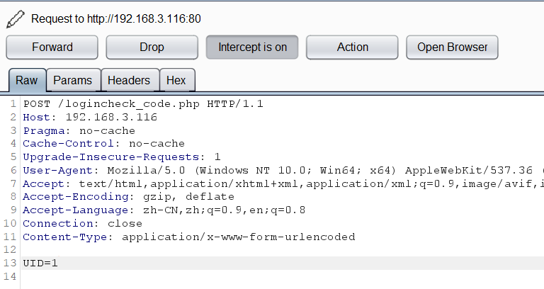
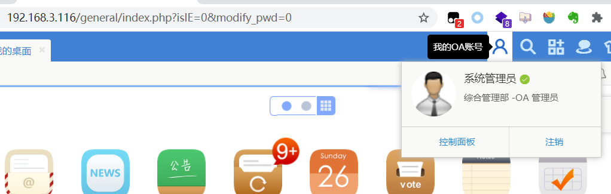
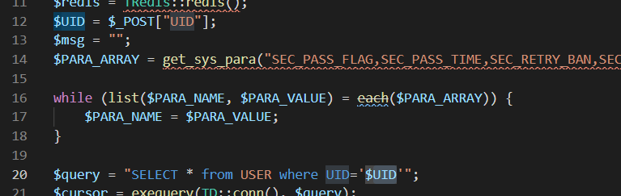
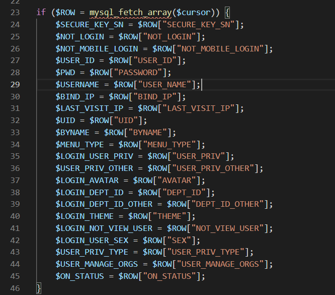
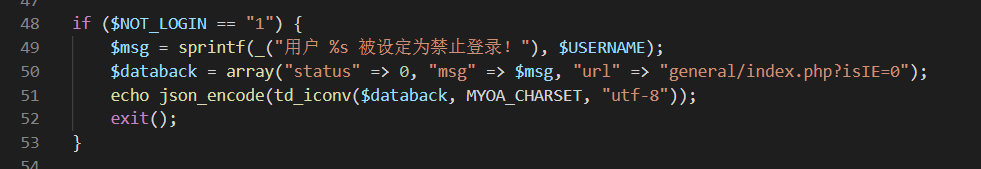
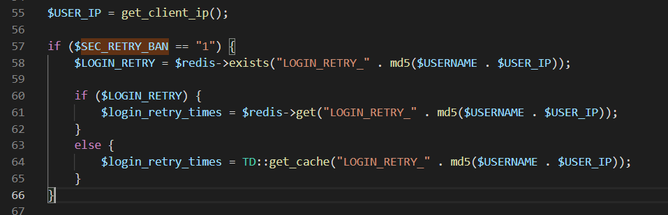
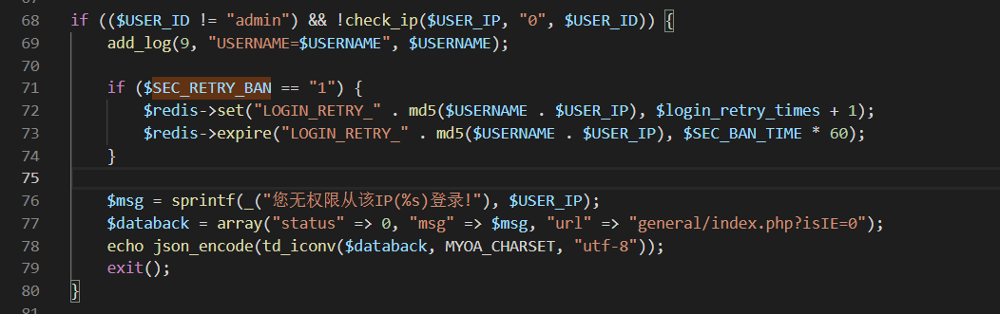
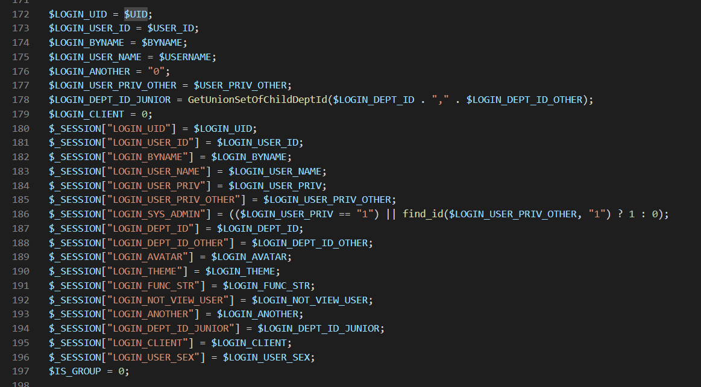

## 漏洞概述
通达OA系统采用领先的B/S(浏览器/服务器)操作方式，使得网络办公不受地域限制。
Office Anywhere采用基于WEB的企业计算，主HTTP服务器采用了世界上最先进的
Apache服务器，性能稳定可靠。数据存取集中控制，避免了数据泄漏的可能。提供数据备份工具，保护系统数据安全。多级的权限控制，完善的密码验证与登录验证机制更加强了系统安全性。

未经授权的攻击者通过构造请求包实现用户登录，又由于UID是主键且步进为1递增，从而导致可以指定UID实现任意用户登录（admin的缺省UID为1）。

## 漏洞环境
**官网**：https://www.tongda2000.com/

**下载**：链接：https://pan.baidu.com/s/1RLoz7wUZc0Hr9S7aBoxYew  提取码：thcz 

**版本**：
通达OA 2017版

**测试系统**：
Windows 7 家庭版 64位操作系统
Windows 10 教育版（攻击机）

## 漏洞复现

1. 使用burp拦截，访问/logincheck_code.php，burp断下后修改如下：

  a) GET请求修改为POST请求

  b) 删除Cookie字段

  c）添加请求体UID=1

  d) 添加Content-Type: application/x-www-form-urlencoded

经过测试，使用app扫码登录时，可以捕获到/logincheck_code.php这一条数据包。

  

2. 该请求成功后会返回一个管理员cookie

3. 访问后台
     后台首页地址是：http://192.168.3.116/general/index.php?isIE=0&modify_pwd=0，直接带上上一步返回的cookie访问该地址，就实现了任意用户登录了，权限是系统管理员
       
## 漏洞原理
通过漏洞复现，可以得知，漏洞点存在于logincheck_code.php，解密源码后找到logincheck_code.php
可以看到UID参数可控，通过POST请求获取


然后会根据UID获取数据库中的数据



判断是否是被禁用户



记录被ban用户尝试登录次数



被ban用户第一次登录会收到提醒，第二次以后会设置ban的过期时间



之后都是一些多端登录之类的操作，有兴趣可以自己看一看，关键的还是在后面。
180行可以看到UID被保存到session中，这样，有可控参数，并且这个可控参数会被保存到session，这就可能存在任意用户登录了，我们可以合理猜测，只要构造一个管理员UID，系统就会通过cookie返回管理员的sessionid，之后再通过该sessionid登录就可以实现任意用户登录了。



网上看到该地址存在的漏洞需要构造UID=1&CODEUID=_PC{xxxxxxxx}，并通过访问/ispirit/login_code.php获取codeuid，但是通过查看通达2017源码可以看到，它并没有检测codeuid，直接构造一个UID即可


## 总结
从白盒角度来看，可以通过源码中找到可控输入参数，如果这个参数还会被保存为session，就可以猜测存在任意用户登录。
通过源码构造poc，这里是通过POST接收参数，因此请求采用POST，另外需要UID，可以合理猜测UID=1是管理员，这也可通过本地数据库进行验证，从我的另一篇博客文章也可以证明这一点：https://tutucoo.gitee.io/%E9%80%9A%E8%BE%BE-oa-office-anywhere-v11%E4%BB%BB%E6%84%8F%E7%94%A8%E6%88%B7%E7%99%BB%E5%BD%95%E6%BC%8F%E6%B4%9E%E5%A4%8D%E7%8E%B0%E4%B8%8E%E5%8E%9F%E7%90%86%E8%AF%A6%E7%BB%86%E8%A7%A3%E6%9E%90/#5-%E6%BC%8F%E6%B4%9E%E5%8E%9F%E7%90%86

POST请求通常还需要请求头Content-Type，Content-Type有以下几种类型：

```
application/x-www-form-urlencoded 在发送前编码所有字符（默认）
multipart/form-data 不对字符编码,在使用包含文件上传控件的表单时，必须使用该值。
text/plain 空格转换为 "+" 加号，但不对特殊字符编码。
```
通常测试任意用户登录使用的是x-www-form-urlencoded，此外，还可以测试带上Content-Length: 100，有时候服务器会对该字段进行检测。
从黑盒的角度来看，如果在测试过程中看到login_code_check这样的地址，看英文意思也能猜出是用于登录检测了，那么就是任意用户登录高发的位置了，如果请求体中还包含了UID，不妨试一下UID=1，再通过返回的cookie直接访问后台地址，如果可以正常访问，那么就是任意用户登录了。


